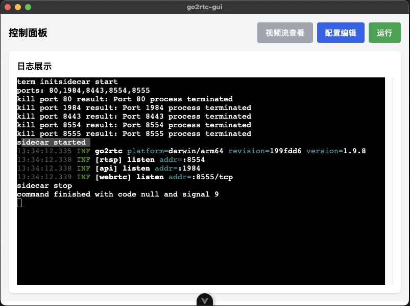

# go2rtc-tauri

A go2rtc GUI tool

## 介绍



这个项目是一个简单 go2rtc GUI 工具，使用`Rust`编写，并使用`Vue3`作为前端框架。

借用了 [go2rtc](https://github.com/AlexxIT/go2rtc) 可执行文件，以实现跨平台(windows/macos/linux)

go2rtc 支持的系统架构

- [go2rtc_linux_amd64](https://github.com/AlexxIT/go2rtc/releases/download/v1.9.8/go2rtc_linux_amd64)
- [go2rtc_linux_arm](https://github.com/AlexxIT/go2rtc/releases/download/v1.9.8/go2rtc_linux_arm)
- [go2rtc_linux_arm64](https://github.com/AlexxIT/go2rtc/releases/download/v1.9.8/go2rtc_linux_arm64)
- [go2rtc_linux_armv6](https://github.com/AlexxIT/go2rtc/releases/download/v1.9.8/go2rtc_linux_armv6)
- [go2rtc_linux_i386](https://github.com/AlexxIT/go2rtc/releases/download/v1.9.8/go2rtc_linux_i386)
- [go2rtc_linux_mipsel](https://github.com/AlexxIT/go2rtc/releases/download/v1.9.8/go2rtc_linux_mipsel)
- [go2rtc_mac_amd64.zip](https://github.com/AlexxIT/go2rtc/releases/download/v1.9.8/go2rtc_mac_amd64.zip)
- [go2rtc_mac_arm64.zip](https://github.com/AlexxIT/go2rtc/releases/download/v1.9.8/go2rtc_mac_arm64.zip)
- [go2rtc_win32.zip](https://github.com/AlexxIT/go2rtc/releases/download/v1.9.8/go2rtc_win32.zip)
- [go2rtc_win64.zip](https://github.com/AlexxIT/go2rtc/releases/download/v1.9.8/go2rtc_win64.zip)
- [go2rtc_win_arm64.zip](https://github.com/AlexxIT/go2rtc/releases/download/v1.9.8/go2rtc_win_arm64.zip)

本项目暂时仅支持 3 种最常用的系统架构

- [go2rtc_linux_amd64](https://github.com/AlexxIT/go2rtc/releases/download/v1.9.8/go2rtc_linux_amd64)
- [go2rtc_mac_arm64.zip](https://github.com/AlexxIT/go2rtc/releases/download/v1.9.8/go2rtc_mac_arm64.zip)
- [go2rtc_win64.zip](https://github.com/AlexxIT/go2rtc/releases/download/v1.9.8/go2rtc_win64.zip)

## 功能

- 主页面有“配置编辑”， “视频预览”， “日志展示” 以及 “运行/停止” 的按钮入口
- 通过 vue3 router 来实现页面跳转，如主页面，配置编辑，视频预览，日志展示
- 配置 https://raw.githubusercontent.com/AlexxIT/go2rtc/master/website/schema.json
- 会在运行前，kill 占用需要端口的程序，并启动 go2rtc

## AI Prompts

- 通过这个 [schema.json](https://raw.githubusercontent.com/AlexxIT/go2rtc/master/website/schema.json) 来生成配置编辑页面，使用`vue3`与`unocss`实现，在这个页面代码的基础上，拆分页面，添加一个切换按钮，初始化是显示组件化的配置编辑组件，切换到非组件化组件时，显示一个输入框。为这两个组件单独创建一个单独的组件，通过切换按钮来切换页面。

## 缺陷

- ~~暂时解决不了 js 直接调用 tauri2.0 sidecar 时，无法实时输出 stdout/stderr~~ [已解决]

## 发布

```bash
git tag -d v1.1.0
git push origin --delete v1.1.0
git tag -a v1.1.0 -m "Release version 1.1.0"
git push origin v1.1.0
```

## 许可证

MIT
